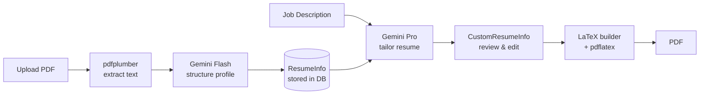
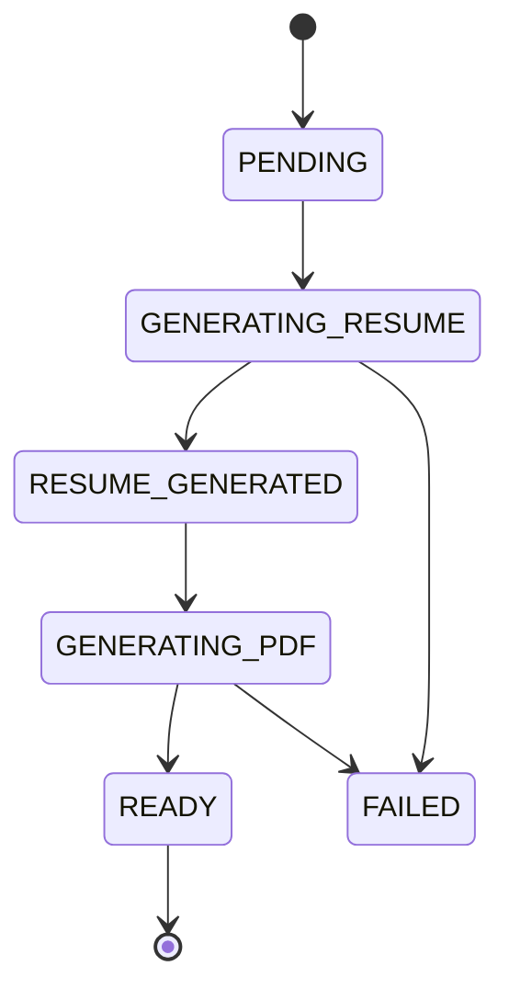

# ATS Beater

Open-source AI-powered resume tailoring service. Upload your PDF resume, paste a job description, and get an ATS-optimized tailored resume compiled to PDF.

Built with FastAPI, Vue 3, Google Gemini, and LaTeX.

**Live at [atsbeater.cydratech.com](https://atsbeater.cydratech.com)**

## How It Works



**Phase 1 — AI Generation:** Your structured profile + the job description go to Gemini Pro, which produces a tailored, keyword-optimized resume. You can review and edit before proceeding.

**Phase 2 — PDF Compilation:** The tailored resume is converted to LaTeX using a custom document class (`resume.cls`), then compiled to PDF via `pdflatex`.

### Job Status Flow



## Features

- **Resume Roast** — Free AI-powered resume analysis with ATS readiness checklist
- **AI Resume Tailoring** — Gemini Pro tailors your resume for each specific job description
- **LaTeX PDF Generation** — Professional typesetting that passes ATS parsing reliably
- **AI Chat Editor** — Refine your resume through conversation (powered by Google ADK)
- **Credit System** — Daily free credits + purchasable credit packs via Razorpay
- **Multi-tenancy** — Organization labeling with auto-assignment via email domain rules
- **Admin Panel** — Full CRUD for users, tenants, credits, promo codes, transactions
- **Shareable Roast Links** — Share your resume roast results with a public link

## Tech Stack

| Layer | Tech |
|-------|------|
| Backend | FastAPI, SQLAlchemy (async), PostgreSQL, Alembic |
| AI | Google `google-genai` SDK, Google ADK (chat agents) |
| PDF | pdflatex + custom `resume.cls`, pdfplumber for extraction |
| Frontend | Vue 3 + Tailwind CSS + Pinia — all via CDN, no build step |
| Auth | Google OAuth 2.0 → JWT |
| Payments | Razorpay (credit packs, time passes) |
| Storage | Google Cloud Storage |
| Package mgr | [UV](https://docs.astral.sh/uv/) |

## Quick Start

### Prerequisites

- **Python 3.12+**
- **Docker** (for PostgreSQL)
- **TeX Live** with `pdflatex`
  - macOS: `brew install --cask mactex`
  - Ubuntu: `apt install texlive-latex-base texlive-latex-recommended texlive-latex-extra texlive-fonts-recommended lmodern`
- **UV** package manager: `curl -LsSf https://astral.sh/uv/install.sh | sh`

### Setup

```bash
# Clone
git clone https://github.com/cydratech/ats-beater.git && cd ats-beater

# Copy environment file and fill in your keys
cp .env.example .env

# Start PostgreSQL
docker compose up -d

# Install dependencies
uv sync --extra dev

# Run database migrations
uv run alembic upgrade head

# Start the server
uv run python -m app.main
```

Open **http://localhost:8000**. Set `DEV_AUTH_BYPASS=true` in `.env` to skip Google OAuth during development.

### Required API Keys

| Key | Where to get it |
|-----|----------------|
| `GEMINI_API_KEY` | [Google AI Studio](https://aistudio.google.com/apikey) |
| `GOOGLE_CLIENT_ID` / `GOOGLE_CLIENT_SECRET` | [Google Cloud Console](https://console.cloud.google.com/apis/credentials) — create OAuth 2.0 credentials |
| `RAZORPAY_KEY_ID` / `RAZORPAY_KEY_SECRET` | [Razorpay Dashboard](https://dashboard.razorpay.com/) (optional — for payments) |

## Running Tests

```bash
# Unit tests (in-memory SQLite, no external dependencies)
uv run pytest tests/ -v --ignore=tests/integration

# Integration smoke tests (needs running DB + Gemini API key + pdflatex)
INTEGRATION=1 uv run pytest tests/integration/ -v
```

173 unit tests covering models, schemas, API routes, LaTeX builder/sanitizer, JWT handler, credit service, and more.

## Project Structure

```
app/
  main.py                  # FastAPI factory, CORS, exception handlers
  config.py                # Pydantic BaseSettings from .env
  dependencies.py          # Auth (JWT/dev bypass), DB session
  models/                  # SQLAlchemy ORM (User, Profile, Job, Credit, Roast, Tenant)
  schemas/                 # Pydantic schemas (ResumeInfo, CustomResumeInfo, etc.)
  services/
    ai/                    # Gemini inference + prompts + retry
    ocr/                   # PDF text extraction (pdfplumber + Gemini vision fallback)
    latex/                 # LaTeX builder, compiler, sanitizer
    chat/                  # AI chat agents (Google ADK) for resume editing
    profile/               # Profile CRUD + background processing
    job/                   # Job generation (Phase 1 + Phase 2)
    credit/                # Credit balance, deduction, refund, promo codes
    payment/               # Razorpay integration
    storage/               # GCS upload/download
  api/                     # FastAPI route handlers

frontend/
  index.html               # SPA shell (CDN imports, CSS)
  landing.html             # Public landing page
  static/js/app.js         # Entire Vue 3 app (stores, pages, router)

tests/                     # 173 unit tests + integration smoke tests
alembic/                   # Database migrations
resume.cls                 # LaTeX document class
infra/                     # Docker, Cloud Run deploy script, entrypoint
```

## API Endpoints

### Auth
| Method | Path | Description |
|--------|------|-------------|
| GET | `/auth/google/login` | Returns Google OAuth URL |
| GET | `/auth/google/callback` | Exchanges auth code, redirects with JWT |
| GET | `/auth/me` | Current user info |

### Profiles
| Method | Path | Description |
|--------|------|-------------|
| POST | `/profiles/upload` | Upload PDF resume (202, background processing) |
| GET | `/profiles/` | List profiles (paginated) |
| GET | `/profiles/{id}` | Get profile with resume_info |
| PUT | `/profiles/{id}` | Update resume_info |
| DELETE | `/profiles/{id}` | Soft delete |

### Jobs
| Method | Path | Description |
|--------|------|-------------|
| POST | `/jobs/` | Create job (profile_id + job description) |
| POST | `/jobs/{id}/generate-resume` | Trigger AI tailoring (202, deducts credit) |
| POST | `/jobs/{id}/generate-pdf` | Trigger LaTeX compilation (202) |
| GET | `/jobs/{id}/pdf` | Download generated PDF |
| GET | `/jobs/{id}` | Get job details |
| POST | `/jobs/{id}/chat` | Chat with AI to edit resume (SSE stream) |

### Roasts
| Method | Path | Description |
|--------|------|-------------|
| POST | `/roasts/upload` | Upload PDF for AI roast (free, 202) |
| GET | `/roasts/` | List roasts (paginated) |
| GET | `/roasts/shared/{share_id}` | Public shared roast (no auth) |

### Credits & Payments
| Method | Path | Description |
|--------|------|-------------|
| GET | `/credits/packs` | List credit packs (public) |
| GET | `/credits/me` | Balance + daily free + active pass |
| POST | `/credits/redeem-promo` | Redeem promo code |
| POST | `/payments/create-order` | Create Razorpay order |
| POST | `/payments/verify` | Verify payment + credit account |

### Admin
Full CRUD for tenants, users, domain rules, credit packs, time passes, promo codes, and transactions under `/admin/*`. Requires `is_super_admin` flag.

## Credit System

| Priority | Source | Details |
|----------|--------|---------|
| 1 | Active time pass | Unlimited (no deduction) |
| 2 | Daily free | 3/day (configurable), resets at midnight UTC |
| 3 | Purchased credits | From balance |
| 4 | No credits | 429 error, frontend shows paywall |

Credits are deducted synchronously before generation starts. If generation fails, a refund is issued automatically.

## Deployment

### Docker

```bash
docker build -t ats-beater .
docker run -p 8080:8080 --env-file .env ats-beater
```

### Cloud Run

```bash
export GCP_PROJECT_ID=your-project
bash infra/deploy-cloudrun.sh
```

The deploy script handles Artifact Registry, Docker build, push, and Cloud Run deployment. See `infra/deploy-cloudrun.sh` for details.

### Environment

All configuration is via environment variables. See `.env.example` for the full list.

For production, you'll need:
- PostgreSQL instance (Cloud SQL or self-hosted)
- GCS bucket for PDF storage
- Google OAuth credentials with correct redirect URI
- Razorpay keys (optional — for payments)

## Key Design Decisions

- **Two-phase generation** — AI tailoring and PDF compilation are separate. Users can review/edit the AI output before committing to PDF.
- **Background processing** — Profile OCR and job generation run as tracked async tasks with independent DB sessions.
- **Dual extraction** — pdfplumber first (instant), Gemini vision OCR fallback for scanned PDFs.
- **LaTeX over HTML-to-PDF** — Professional typesetting that passes ATS parsing. Custom `resume.cls` handles formatting.
- **No build step frontend** — Vue 3 CDN global build. Just static files served by FastAPI. No Node.js needed.
- **AI chat agents** — Google ADK powers the resume editing chat with tool-calling (read/edit via JSON Patch).

## Contributing

Contributions are welcome! Please open an issue first to discuss what you'd like to change.

## License

MIT License. See [LICENSE](LICENSE).

---

Built by [Cydratech](https://cydratech.com)
